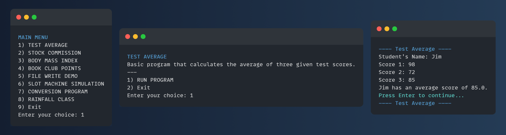

# CST 150 Projects

> Computer Science I - Introduction to programming and computer science using the OOP language Java.

This repository contains a collection of my CST 150 Java assignments highlighting practical application of Java programming skills. These projects were completed as part of my Computer Science coursework.

## Contents



Source codes for these projects are found in the folder "src".

1. **Test Average:** [[Source](src/TestAverage/TestAverage.java)]
2. **Stock Commission:** [[Source](src/StockCommission/StockCommission.java)]
3. **Body Mass Index:** [[Source](src/BodyMassIndex/BodyMassIndex.java)]
4. **Book Club Points:** [[Source](src/BookClubPoints/BookClubPoints.java)]
5. **File Write Demo:** [[Source](src/FileWriteDemo/FileWriteDemo.java)]
6. **Slot Machine Simulation:** [[Source](src/SlotMachineSimulation/SlotMachineSimulation.java)]
7. **Conversion:** [[Source](src/Conversion/Conversion.java)]
8. **Rainfall:** [[Source](src/Rainfall/Main.java)]

## How to run

1. **Clone the Repository:**
   ```shell
   git clone https://github.com/ARey-H39/CST150-Projects.git
   ```
2. **Compile and Run:**
    * _Using a Command Line:_
      ```shell
      cd CST150-Projects
      javac Main.java
      java Main
      ```
    * _Using an IDE:_ Import the project into your preferred IDE and run the desired program.
